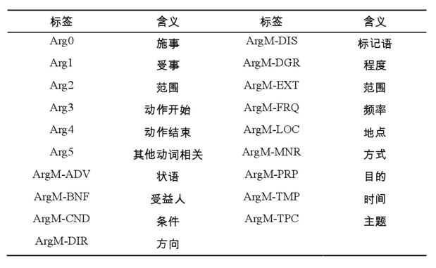

- [x] word 大小写
- [x] 半型及全型形式 Unicode字符 a:ff41
- [x] subword 英文等
- [x] 计算F1. seqeval 
- [x] vocab 覆盖率，时间
- [ ] 根据BIO标签结果，提出解码约束算法或者强约束条件，如CRF。(BIO不需要强约束，OIO是允许的)
- [ ] POS输入。
- [ ] 无谓语预测
- [ ] 多谓语预测
- [ ] 一次性全预测
- [x] ELMO / pretrained embedding
- [ ] 字符级embedding
- [ ] 语法含义输入
- [ ] 标签细分问题

  
• EXT - extent  
• DIR - direction  
• LOC - location  
• TMP - temporal  
• REC - reciprocal  
• PRD - predication  
• NEG - negation  
• MOD - modal  
• ADV - adverbial  
• MNR - manner  
• CAU - cause  
• PNC - purpose not cause.  
• DIS - discourse 

precision: 预测值为1且真实值也为1的样本在预测值为1的所有样本中所占的比例  
recall: 预测值为1且真实值也为1的样本在真实值为1的所有样本中所占的比例  
F1-Score: 2 * (precision * recall) / (precision + recall)  
准确率: accuracy = 预测对的元素个数/总的元素个数  
查准率：precision = 预测正确的实体个数 / 预测的实体总个数  
召回率：recall = 预测正确的实体个数 / 标注的实体总个数  
F1值：F1 = 2 * 查准率 * 召回率 / (查准率 + 召回率)  

Macro-F1和Micro-F1是相对于多标签分类而言的。  
Micro-F1，计算出所有类别总的Precision和Recall，然后计算F1。  
Macro-F1，计算出每一个类的Precison和Recall后计算F1，最后将F1平均。

标签类别问题,B-rel
c-argm-TMP / c-arg0 (c表示共指)  
r-arg0  
rel 和 v  
转化成conll数据后，有偏差   